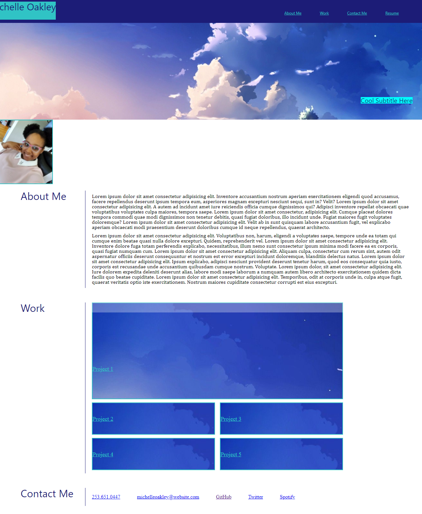

# michelle-oakley-portfolio

## Motivation for this Project

Wanting a portfolio to present to future employers and collaborators.

## Reason for Project

To have a professinal, responsove, and visually appealing portfolio website. 

## What I Learned from this Project

I learned some very useful things for my future development career such as;

   *  To Be patient with myself.

   *  Make your comments as you are doing your code. This way you don't forget what you have done later.

   *  Keeping classes in the correct order can be a surmountable challange.

   *  Collaboration is key to success. 

   *  Tutors are a gift from above. 

## Credits

William Crownover and William Kuo: Thank you for helping me claw out solutions.

 https://michellecoder.github.io/michelle-oakley-portfolio/

